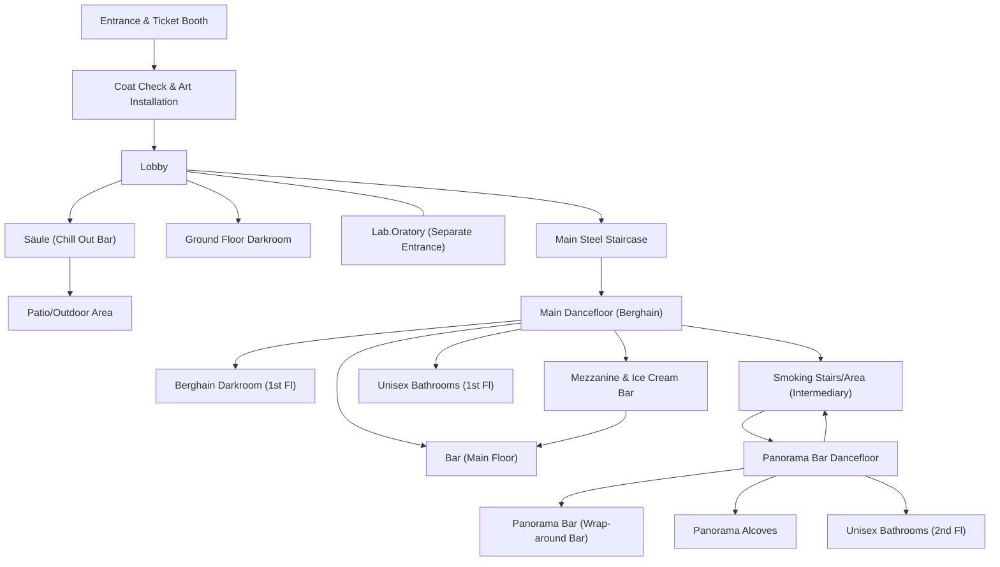

## Berghain Floor Layout Overview

Berghain is housed in a massive former power station, structured across **two main public floors** (plus mezzanines and adjacent spaces), each serving distinct clubbing experiences. Below is a detailed description of its layout, spatial connections, and use, followed by a Mermaid diagram visually mapping the relationships between areas.

### Key Spaces and Connections

#### Ground Floor
- **Entrance/Lobby:**
    - Contains **ticket booth**, **coat-check**, and **large art installation**.
- **Säule (Chill Out/Bar):**
    - Adjacent to the lobby, often used as a chill-out space with its own bar[9].
- **Large Darkroom:**
    - Reserved mainly for male-male sexual play, situated off the main entry area[1][2].
- **Main Steel Staircase:**
    - Leads up to the Berghain main dance floor and mid-level[1][2].
- **Patio/Outdoor Area:**
    - Accessed via the eastern ground floor, features a bar, a net-covered dancefloor, and cushions[1][2].
- **Lab.Oratory (separate entrance):**
    - Hardcore gay male fetish club, generally segregated except during special events[1].

#### First Floor (Main Club Room / "Berghain")
- **Berghain Dancefloor:**
    - The colossal former turbine hall with high ceilings, seven FunktionOne speaker stacks, and space for about 500 people[1][2].
- **Bars:**
    - At least two bars: one accessible from the dancefloor, another near the mezzanine[1][2].
- **Darkroom:**
    - Additional darkroom separate from the ground floor space[1][2].
- **Mezzanine:**
    - With an **ice cream bar** and overlooking views onto the dancefloor[1][2].
- **Unisex Bathrooms:**
    - Spacious, adjacent to both the dancefloor and mezzanine[1][2].
- **Steel Staircase (internal):**
    - Connects up to Panorama Bar above the Berghain floor (in the former control room)[1][2].

#### Second Floor (Panorama Bar)
- **Panorama Bar Dancefloor:**
    - Known for its wrap-around black rubber bar, iconic Wolfgang Tillmans' photographs, and DJ booth suspended by chains[1][2].
- **Panorama Bar Alcoves:**
    - Small cushioned spaces, formerly storage lockers[1][2].
- **Unisex Bathrooms:**
    - Additional set separate from the first-floor bathrooms[1][2].
- **Smoking Area:**
    - Usually adjacent to bar spaces[1][2].
- **Steel Stairs and Doors:**
    - Multiple interior steel staircases connect down to both Berghain and back to the ground floor; some lead to external fire exits[1][2].

### Notes on Spatial Connections

- **Movement**: The club is fundamentally vertical, relying on steel staircases stacked near the center to move guests between primary areas.
- **Segmentation**: Each floor and significant room (Berghain, Panorama Bar, Säule, Lab.Oratory) is semi-isolated, often only directly accessible by internal stairs.
- **Patio & Outdoor**: Open seasonally and for major daytime events, leading directly from the ground floor[1][2].
- **Accessibility**: Lab.Oratory has a physically separate, less visible entrance for privacy and subcultural reasons, but connects to the main building internally on special occasions[1].

**Sources describe Berghain’s layout in architectural and clubbing media, with partial diagrams and textual overviews clarifying these spatial relationships[1][2][4][5].**

[1] https://www.slowtravelberlin.com/berghain-panorama-bar/
[2] https://lmgmblog.wordpress.com/2010/07/06/draft-profile-berghain-panorama-bar/
[3] https://www.pollmeier.com/cases/robust-seating-in-the-berghain-techno-club/
[4] https://www.karhard.de/projects/berghain
[5] https://www.technoairlines.com/blog/images-taken-in-the-top-secret-club-berghain
[6] https://www.reddit.com/r/berlin/comments/17hy7x/berghain_map_a_bit_outdated/
[7] https://goodmorningberlin.com/berghain-ou-le-club-sorti-de-la-quatrieme-dimension/
[8] https://www.tiktok.com/@archi.city/video/7357894218213330209
[9] https://dispatcheseurope.com/berghain-pt-2-inside-berlins-sexy-libertine-metropolitan-museum-of-techno/

Great question! Yes—the **smoking area** (specifically, the narrow stairwell/landing commonly referred to as the “smoking stairs”) is a major internal passage at Berghain. It enables movement between the floors (Berghain main floor ↔ Panorama Bar), and is often used as a shortcut, connecting otherwise separated zones.

**Correction:**  
In Berghain’s layout, the main “smoking area” isn’t a room on just the Panorama Bar (second floor); instead, it’s positioned on the intermediate stairwell between the main Berghain dancefloor and Panorama Bar, with doors leading both up and down. It’s the only legal spot for smoking indoors and serves as a popular social/circulation hub.

**Therefore,**
- You can use the “smoking area/stairs” to move directly up or down between Berghain and Panorama Bar.
- It’s not simply an adjunct to Panorama Bar, but a connecting point between major zones.

Below is the **corrected Mermaid diagram,** highlighting the smoking area/stairwell as a bridge between floors:

**Key change:**
- The node SmokingStair (smoking stairs/area) is now positioned as a connector (↕️) between BerghainDF and PanoramaDF.
- This reflects real club flow: many move between floors via the smoking stairs/landing rather than only using the main staircase.

**Summary:**  
Yes—you can move between Berghain’s main dancefloor and Panorama Bar via the smoking stairs/area, and the diagram is now updated accordingly!

[1] https://onthebeatingtravel.com/berghain-15-things-you-should-know/
[2] https://www.slowtravelberlin.com/berghain-panorama-bar/
[3] https://faqabout.me/iam/berghain
[4] https://www.reddit.com/r/Berghain_Community/comments/14d9llv/smoking_should_be_only_in_smoking_areas_and_garten/
[5] https://www.technoairlines.com/blog/images-taken-in-the-top-secret-club-berghain
[6] https://lonelypirouette.com/blog/the-berghain-experience-how-i-got-in-my-first-time-to-berlin/
[7] https://www.tiktok.com/@madsabroad/video/7373801479225740590?lang=en
[8] https://www.wmagazine.com/culture/bergain-art-exhibition-boros-berlin
[9] https://pubcrawlberlin.de/exploring-berlin-clubs-guide-for-absolute-beginners/
[10] https://www.gaytravel4u.com/event/snax-berlin-berghain-at-lab-oratory/